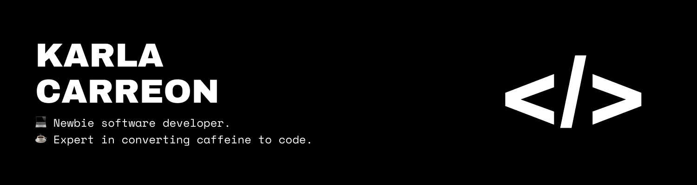

## 👋🏼 Hello there! 

My name is **Karla** and I'm a trainee software developer at [Northcoders](http://northcoders.com), and I like building things.

When I'm not coding, I'm either reading a book, playing something on my Nintendo Switch, or bingeing something on Netflix. I'm a huge fan of occasional naps as well. 💤

- 📚 **Currently Reading**: The House in the Cerulean Sea by TJ Klune
- 🎮 **Currently Playing**: The Graveyard Keeper
- 📺 **Currently Watching**: The Office (US)

## 💻 Coding Journey

I started self-teaching in May 2021 and enrolled at Northcoders in October of the same year. I've always been passionate about the tech field and building things through coding, and I can't wait to learn more technologies and be able to build more cool things.

### ✨ Current Tech Skills 
- **Language/s**: Javascript
- **Frontend**: ReactJS, HTML5, CSS3
- **Backend**: NodeJS, ExpressJS, SQL (PostgreSQL, mySQL), RESTful APIs
- **Testing**: Jest, Supertest
- **Version Control**: Git

## ➡️ Reach me!
[LinkedIn](http://linkedin.com/in/karla-carreon)   |   [Medium](http://medium.com/@karlacodes)   |   [Twitter](http://twitter.com/karlacodes)   |   [Email](mailto:carreon.karlamaye@gmail.com)
